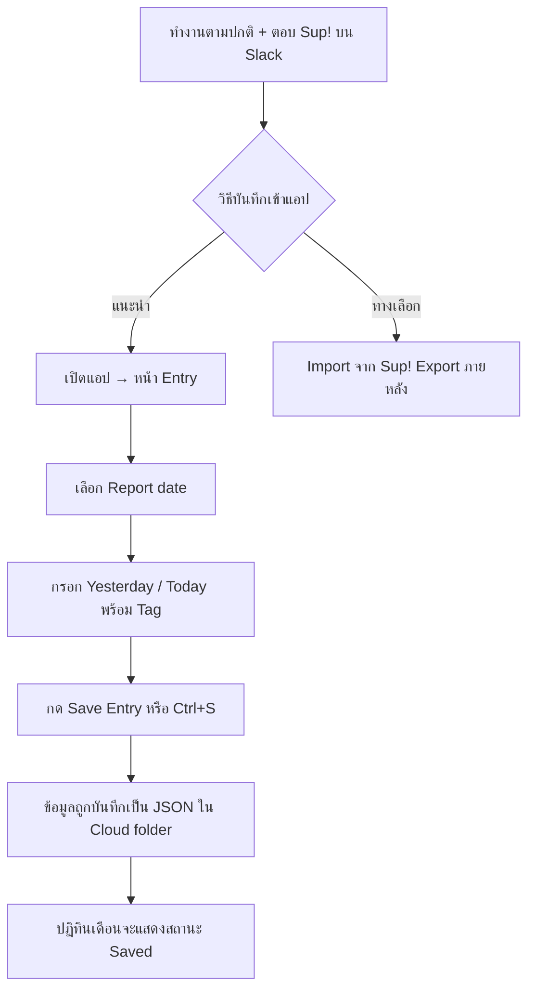
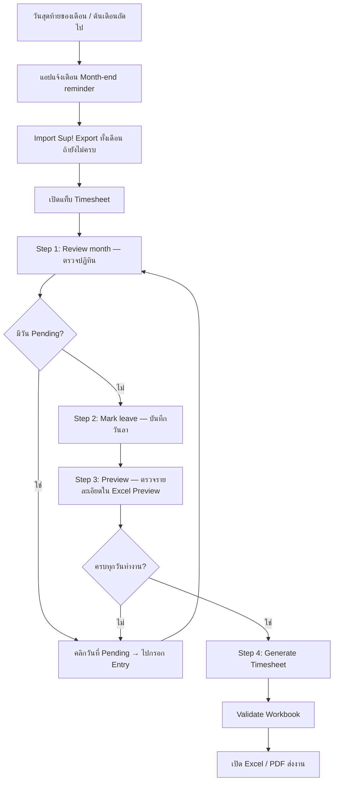

# คู่มือการใช้งาน Sup Timesheet Automation

**เวอร์ชันแอป:** 0.2.3  
**กลุ่มผู้ใช้:** ทีม QA / Consultant ที่ต้องส่ง Timesheet รูปแบบ SkillLane จากข้อมูล Sup! รายวัน

---

## สารบัญ

1. [ภาพรวมแอปพลิเคชัน](#ภาพรวมแอปพลิเคชัน)
2. [Workflow การใช้งาน](#workflow-การใช้งาน)
3. [การติดตั้งครั้งแรก](#การติดตั้งครั้งแรก)
4. [ตั้งค่าโฟลเดอร์ Google Drive (Sync หลายเครื่อง)](#ตั้งค่าโฟลเดอร์-google-drive-sync-หลายเครื่อง)
5. [หน้า Entry — บันทึกงานรายวัน](#หน้า-entry--บันทึกงานรายวัน)
6. [หน้า Timesheet — สร้างไฟล์ส่งงาน](#หน้า-timesheet--สร้างไฟล์ส่งงาน)
7. [หน้า Settings — ตั้งค่าระบบ](#หน้า-settings--ตั้งค่าระบบ)
8. [รูปแบบข้อความ Sup! และ Tag](#รูปแบบข้อความ-sup-และ-tag)
9. [การลา (Annual / Sick Leave)](#การลา-annual--sick-leave)
10. [Overtime (ทำงานล่วงเวลา)](#overtime-ทำงานล่วงเวลา)
11. [การ Import จาก Sup! Export](#การ-import-จาก-sup-export)
12. [การแจ้งเตือนและ Reminder](#การแจ้งเตือนและ-reminder)
13. [โครงสร้างไฟล์ข้อมูล](#โครงสร้างไฟล์ข้อมูล)
14. [คีย์ลัด (Keyboard Shortcuts)](#คีย์ลัด-keyboard-shortcuts)
15. [คำสั่ง CLI (สำหรับ Developer)](#คำสั่ง-cli-สำหรับ-developer)
16. [ข้อควรระวังด้านความปลอดภัย](#ข้อควรระวังด้านความปลอดภัย)
17. [แก้ปัญหาเบื้องต้น](#แก้ปัญหาเบื้องต้น)

---

## ภาพรวมแอปพลิเคชัน

**Sup Timesheet Automation** ช่วยแปลงข้อมูลงานรายวันจาก Sup! (Stand-up บน Slack) ให้เป็นไฟล์ Excel/PDF Timesheet ตามเทมเพลตทางการของ SkillLane โดยอัตโนมัติ

### สิ่งที่แอปทำได้

| ความสามารถ | รายละเอียด |
|-----------|-----------|
| บันทึกงานรายวัน | เก็บ Yesterday / Today ตามรูปแบบ Sup! |
| Import จาก Sup! | นำเข้าจากไฟล์ Export ของ Sup! ทีละเดือนหรือหลายเดือน |
| สร้าง Timesheet | เติมชีต `Timesheet - Standard Hours` ในไฟล์ `.xlsx` ทางการ |
| จัดการวันลา | Annual leave, Sick leave (รวม half-day) |
| วันหยุด | วันหยุดนักขัตฤกษ์ไทย + วันหยุดบริษัทเพิ่มเติม |
| Overtime | เติมชีต Overtime เมื่อมีข้อมูล (ถ้ามี) |
| Sync หลายเครื่อง | ใช้ Google Drive เป็นโฟลเดอร์ข้อมูลกลาง |
| แจ้งเตือนปลายเดือน | เตือนให้ Import Sup! ก่อนส่ง Timesheet |

### สิ่งที่แอปไม่ทำ

- ไม่สรุปหรือเขียนข้อความใหม่ — เก็บคำพูดดิบจาก Sup! ตามที่คุณเขียน
- ไม่ล็อกอิน Slack แทนคุณโดยตรงใน Desktop App (ใช้ Import หรือ CLI collect แทน)
- ไม่แทนที่การอนุมัติ Timesheet จากหัวหน้างาน

---

## Workflow การใช้งาน

### Workflow รายวัน (ทุกวันทำงาน)



**ขั้นตอนสั้น ๆ ทุกวัน**

1. ตอบ Sup! บน Slack ตามปกติ (ใส่ Tag เช่น `[Meeting]`, `[Testing]`, `[Develop]`)
2. เปิดแอป → **Entry**
3. เลือก **Report date** (วันที่ของรายงาน)
4. คัดลอกหรือพิมพ์ Yesterday / Today
5. กด **Save Entry**
6. ตรวจสอบปฏิทินในแท็บ **Timesheet** ว่าวันนั้นเป็น **Saved** (สีเขียว)

---

### Workflow สิ้นเดือน (ส่ง Timesheet)



**Checklist สิ้นเดือน**

- [ ] ทุกวันทำงานในปฏิทินเป็น **Saved** หรือ **Annual/Sick leave**
- [ ] วันหยุดและวันลาถูกต้อง
- [ ] Template เดือนนั้น **Found** (มีไฟล์ `.xlsx` ในโฟลเดอร์ templates)
- [ ] Preview ไม่มีแถวสีแดง (missing)
- [ ] Generate สำเร็จ + Validation ผ่าน
- [ ] เปิด PDF/Excel ตรวจครั้งสุดท้ายก่อนส่ง

---

### Workflow ตั้งค่าเครื่องใหม่ / หลายคอมพิวเตอร์


---

## การติดตั้งครั้งแรก

### วิธีที่ 1: ติดตั้งจาก Installer (แนะนำสำหรับผู้ใช้ทั่วไป)

1. รัน `Sup Timesheet Automation Setup 0.2.3.exe` จากโฟลเดอร์ `release/`
2. ติดตั้งและล็อกอิน **Google Drive for Desktop** (บัญชีที่จะใช้ร่วมทุกเครื่อง)
3. เปิดแอป — จะเห็นหน้าต่าง **First-time setup**
4. เลือก:
   - **Use Google Drive** — แนะนำ (sync ข้ามเครื่อง) → อ่านรายละเอียดในหัวข้อถัดไป
   - **Use this PC only** — เก็บใน `Documents/SupTimesheetAutomation` (ไม่ sync)
5. แอปจะพาไปหน้า **Settings** อัตโนมัติ และ **บังคับให้กรอกโปรไฟล์ก่อน** จึงจะใช้ Entry / Timesheet ได้:
   - **Staff name** — ชื่อใน Timesheet (เช่น `Nattachai Satitchai`)
   - **Site** — เช่น `Skilllane`
6. ถ้าติดตั้ง Google Drive for Desktop ไว้แล้ว แอปจะตั้ง Data folder เป็น `{My Drive}/SupTimesheetAutomation` ให้อัตโนมัติ
7. กด **Save & continue** (หรือรอ Autosave แล้วเมนูจะปลดล็อกเองเมื่อครบ)
8. Template พื้นฐานปี 2026 จะถูกคัดลอกเข้าโฟลเดอร์ templates ให้อัตโนมัติ
9. การตั้งค่าอื่น ๆ บันทึกอัตโนมัติ (Autosave)

### วิธีที่ 2: รันจาก Source (สำหรับ Developer)

```powershell
pnpm install
Copy-Item config/config.example.json config/config.local.json
# แก้ไข config/config.local.json
pnpm desktop
```

---

## ตั้งค่าโฟลเดอร์ Google Drive (Sync หลายเครื่อง)

แอป**ไม่ได้ sync เอง** — มันเขียนไฟล์ลงโฟลเดอร์ข้อมูล แล้วให้ **Google Drive for Desktop** เป็นตัวซิงค์ข้ามเครื่อง

### โฟลเดอร์ที่ถูกต้อง

| ใช้ path นี้ | ผล |
|--------------|-----|
| `...\My Drive\SupTimesheetAutomation` | ใช้ได้ — แนะนำ |
| `...\Other computers\...` | **ใช้ไม่ได้** — Drive จะขึ้น error *filesystem is unsupported* |
| `Documents\...` หรือ Downloads นอก My Drive | ไม่ sync ข้ามเครื่อง |

ตัวอย่าง path ที่ถูกต้อง:

```text
G:\My Drive\SupTimesheetAutomation
```

หรือ

```text
C:\Users\<ชื่อผู้ใช้>\Google Drive\My Drive\SupTimesheetAutomation
```

### เครื่องแรก (มีข้อมูลอยู่แล้ว / เริ่มใช้ใหม่)

1. ติดตั้ง **Google Drive for Desktop** และล็อกอินบัญชีงาน
2. เปิดแอป → **Settings** (หรือ First-time setup) → กด **Use Google Drive**
3. ตรวจว่า Data folder เป็น  
   `{My Drive}\SupTimesheetAutomation`
4. สถานะควรเป็น **Synced** และ Drive app: **Running**
5. กด **Open Data Folder** ตรวจว่ามีอย่างน้อย:
   - `inbox/`
   - `templates/`
   - `settings.json`
6. รอให้ไอคอน Google Drive ซิงค์เสร็จ (ไม่อยู่สถานะ uploading ค้าง)

### เครื่องที่สอง (หรือเครื่องถัดไป)

1. ติดตั้ง Drive ล็อกอิน**บัญชีเดียวกัน**กับเครื่องแรก
2. รอให้โฟลเดอร์ `SupTimesheetAutomation` โผล่ใน **My Drive**
3. เปิดแอป → กด **Use Google Drive**  
   (อย่าเลือก Use this PC only)
4. ตรวจ Data folder ว่าชี้ไปโฟลเดอร์เดียวกันใต้ My Drive
5. เปิดหน้า Timesheet / Entry — ควรเห็นข้อมูลที่เครื่องแรก Save ไว้

### สิ่งที่ถูก sync

| โฟลเดอร์/ไฟล์ | เนื้อหา |
|-------------|---------|
| `inbox/` | Entry รายวัน |
| `leave/` | วันลา Annual / Sick |
| `templates/` | เทมเพลต Excel รายเดือน |
| `output/` | ไฟล์ Timesheet ที่ Generate แล้ว |
| `settings.json` | ชื่อพนักงาน, วันทำงาน, วันหยุด ฯลฯ |
| `holidays/` | cache วันหยุดไทย |

### สิ่งที่**ไม่**ควรใส่บน Drive

- โฟลเดอร์ `auth/` / session Slack หรือ Chrome profile
- ไฟล์ config ลับของเครื่อง (`config.local.json`, `.env`)

### ย้ายจากโฟลเดอร์ผิดที่ (เช่น Other computers)

ถ้าเคยวางไว้ใต้ `Other computers` หรือโฟลเดอร์นอก My Drive:

1. คัดลอกทั้งโฟลเดอร์ `SupTimesheetAutomation` ไปไว้ที่  
   `My Drive\SupTimesheetAutomation`
2. ในแอป → Settings → **Use Google Drive**  
   หรือแก้ **Cloud data folder** ให้ชี้ path ใหม่
3. รีสตาร์ทแอปครั้งหนึ่ง แล้วตรวจสถานะ **Synced**
4. หลังเครื่องอื่นเห็นข้อมูลครบแล้ว ค่อยลบโฟลเดอร์เก่าได้

### เคล็ดลับ

- ทั้งสองเครื่องต้องเปิด **Google Drive for Desktop** ค้างไว้เวลาใช้งาน
- หลัง Save Entry / Save leave ไฟล์จะขึ้น Drive เกือบทันที — อีกเครื่องจะรีเฟรชเมื่อโฟกัสหน้าต่างแอปหรือเมื่อไฟล์ในโฟลเดอร์เปลี่ยน
- ถ้า badge เป็น **Outside Drive / Local only** แปลว่า path ยังไม่อยู่ใต้ My Drive → กด **Use Google Drive** อีกครั้ง
- ถ้าขึ้น **Drive stopped** → เปิดแอป Google Drive บน Windows แล้วกด **Refresh sync status**

---

## หน้า Entry — บันทึกงานรายวัน

หน้านี้ใช้บันทึกงานประจำวันให้ตรงกับรูปแบบ Sup!

### องค์ประกอบหลัก

| ส่วน | คำอธิบาย |
|------|----------|
| **Report date** | วันที่ของรายงาน Sup! (ไม่ใช่วันที่เปิดแอปเสมอไป) |
| **Yesterday** | งานที่ทำเสร็จเมื่อวันก่อน |
| **Today** | งานที่วางแผนทำวันนี้ |
| **Insert tag** | ปุ่ม default + tag ที่เคยพิมพ์เอง (reusable) — กดแล้วใส่ `[Tag]` |
| **Metrics** | นับจำนวนรายการ + เวลา Save ล่าสุด |

### ปุ่มสำคัญ

| ปุ่ม | การทำงาน |
|------|----------|
| **Today** | ตั้ง Report date เป็นวันนี้ |
| **Reload** | โหลดข้อมูลที่เคย Save ของวันนั้น |
| **Save Entry** | บันทึกลง JSON ใน cloud folder |
| **Import Sup!** | เลือกไฟล์ Export จาก Sup! นำเข้าหลายวันพร้อมกัน |
| **Clear** | ล้างข้อความในหน้า (ไม่ลบไฟล์ที่ Save แล้ว) |
| **Open Data Folder** | เปิดโฟลเดอร์เก็บข้อมูล |

### หลักการ map ข้อมูลไป Timesheet

- รายละเอียดใน Excel ของ**วันทำงาน**มาจากฟิลด์ **Yesterday** ของรายงาน**วันถัดไป**
- ฟิลด์ **Today** ของวันเดียวกันใช้เมื่อไม่มีรายงานวันถัดไป
- ดังนั้นควร Save ทุกวันทำงาน เพื่อให้แต่ละวันมี detail ครบ

---

## หน้า Timesheet — สร้างไฟล์ส่งงาน

แบ่งเป็น 4 ขั้นตอน:

### Step 1 — Review month

- เลือก **Month** ที่ต้องการสร้าง Timesheet
- ดูปฏิทิน:
  - **Saved** — มีข้อมูลแล้ว
  - **Pending** — ยังไม่มีข้อมูล (คลิกเพื่อไปกรอก Entry)
  - **Holiday** — วันหยุด
  - **Annual / Sick** — วันลา
- ตรวจ **Template for this month** ว่าเป็น **Found**
- ดูชื่อไฟล์ Output ที่จะได้ เช่น `Skilllane - TimeSheet 202607 - Nattachai Satitchai.xlsx`

**การโต้ตอบกับปฏิทิน**

| การกระทำ | ผลลัพธ์ |
|----------|---------|
| คลิกวัน Pending/Saved | เปิด Entry ของวันนั้น |
| Double-click วันทำงาน | เปิดฟอร์ม Mark leave |
| คลิกวัน Annual/Sick | แก้ไขข้อมูลลา |

### Step 2 — Mark leave

| ฟิลด์ | รายละเอียด |
|-------|-----------|
| **Date** | วันที่ลา |
| **Leave type** | Annual leave หรือ Sick leave |
| **Half-day sick leave** | เฉพาะลาป่วยครึ่งวัน — เลือกเช้า `09:00–12:00` หรือบ่าย `13:00–18:00` |
| **Note** | ข้อความเพิ่มใน Excel (ไม่บังคับ) |

### Step 3 — Preview

- กด **Refresh Preview** เพื่อดูตารางก่อน Generate
- แถวสีแดง = วันที่ยังไม่มี detail
- ตรวจ Task Code, เวลา In/Out, Detail ให้ถูกต้อง

### Step 4 — Export

| ปุ่ม | การทำงาน |
|------|----------|
| **Generate Timesheet** | สร้าง `.xlsx` และ `.pdf` (PDF ต้องมี Microsoft Excel บน Windows) |
| **Validate Workbook** | ตรวจว่าครบทุกวันทำงาน |
| **Refresh Summary** | รีเฟรชปฏิทิน |
| **Open Excel / Open PDF** | เปิดไฟล์ที่สร้างแล้ว |

---

## หน้า Settings — ตั้งค่าระบบ

### ข้อมูลส่วนตัว

| การตั้งค่า | คำอธิบาย |
|-----------|----------|
| Staff name | ชื่อบน Timesheet (**บังคับ**) |
| Site | ชื่อบริษัทในไฟล์ output (**บังคับ**) |
| Reminder time | เวลาแจ้งเตือนรายวัน |

> ตอนติดตั้งครั้งแรก เมนู Entry / Timesheet จะถูกล็อกจนกว่า Staff name และ Site จะครบ — กด **Save & continue** เพื่อเริ่มใช้งาน
>
> ถ้ามี Google Drive for Desktop และ sync อยู่ แอปจะตั้ง Data folder ให้อัตโนมัติ

### Cloud storage

- **Use Google Drive** — ตั้ง Data folder เป็น `{My Drive}/SupTimesheetAutomation` (ดูหัวข้อ [ตั้งค่าโฟลเดอร์ Google Drive](#ตั้งค่าโฟลเดอร์-google-drive-sync-หลายเครื่อง))
- **Refresh sync status** — ตรวจว่า Drive ทำงานและโฟลเดอร์อยู่ใน My Drive
- **Cloud data folder** — เปลี่ยน path เองได้ (ต้องอยู่ใต้ My Drive ถ้าต้องการ sync)
- **Template folder** — โฟลเดอร์เก็บเทมเพลต `.xlsx` รายเดือน

> **สำคัญ:** อย่าวางโฟลเดอร์ข้อมูลใต้ `Other computers` — Google Drive จะ sync ไม่ได้

### วันทำงานและวันหยุด

- **Working days** — ค่าเริ่มต้น จันทร์–ศุกร์
- **Thai public holidays** — ดึงอัตโนมัติ เปิด/ปิดแต่ละวันได้
- **Extra holidays** — วันหยุดบริษัทเพิ่ม (รูปแบบ `YYYY-MM-DD` บรรทัดละวัน)

### อื่น ๆ

- **Start with Windows (tray only)** — เริ่มแอปตอน login โดยไม่โชว์หน้าต่าง (อยู่ใน tray)

> **หมายเหตุ:** การตั้งค่าเครื่อง (เช่น Start with Windows) เก็บใน `%APPDATA%` ส่วนชื่อพนักงานและวันหยุด sync ผ่าน `{Cloud folder}/settings.json`

---

## รูปแบบข้อความ Sup! และ Tag

### ตัวอย่างที่แนะนำ

```text
Yesterday
[Meeting]
Sprint planning
[Testing]
Regression New Feature 3.5

Today
[Develop]
Pre-enrollment test script
```

### Tag ที่รองรับในแอป

| Tag | ความหมายทั่วไป |
|-----|----------------|
| `[Meeting]` | ประชุม |
| `[Testing]` | ทดสอบ |
| `[Develop]` | พัฒนา / script |
| `[Migrate]` | ย้าย / migrate test |
| `[Design]` | ออกแบบ |

พิมพ์ tag ใหม่ใน Entry เช่น `[สมองเบลอ]` แล้วแอปจะ**บันทึกเป็น reusable tag อัตโนมัติ** (ขึ้นปุ่ม Insert แถวบนครั้งถัดไป) และ sync ผ่าน `settings.json` / Google Drive  
แถบสรุปด้านล่างก็**กดเพื่อ Insert** ได้เช่นกัน

แอป**ไม่เปลี่ยนข้อความ** — คัดลอกลง Excel ตามที่เขียน รวม Tag

### ข้อความที่แอปกรองออก

บรรทัดที่ขึ้นต้นด้วย `Added by` (จาก bot Sup!) จะไม่นับเป็นรายการงาน

---

## การลา (Annual / Sick Leave)

| ประเภท | Task Code ใน Timesheet | หมายเหตุ |
|--------|------------------------|----------|
| Annual leave | L1 - Annual Leave | เต็มวัน |
| Sick leave | L2 - Sick Leave | เต็มวันหรือครึ่งวัน |
| วันหยุด | H1 - Holiday | จากปฏิทินไทย + extra |

**Sick leave ครึ่งวัน:** เลือก Sick leave → ตอบว่าครึ่งวัน → เลือก **Morning 09:00–12:00** หรือ **Afternoon 13:00–18:00**  
Excel จะใส่ Time In/Out และ Hours ตามช่วงนั้น (เช้า 3 ชม. / บ่าย 5 ชม.) ส่วนลาเต็มวันยังเว้นช่องเวลาว่างเหมือนเดิม

---

## Overtime (ทำงานล่วงเวลา)

ถ้ามี OT ให้สร้างไฟล์:

```text
{data folder}/overtime/YYYY/MM/overtime.json
```

ตัวอย่าง:

```json
{
  "schemaVersion": 1,
  "month": "2026-07",
  "entries": [
    {
      "date": "2026-07-09",
      "timeIn": "18:00",
      "timeOut": "20:00",
      "includedLunchTime": "NO",
      "detail": "[Testing]\nRegression overtime"
    }
  ]
}
```

- ไม่มีไฟล์หรือ `entries` ว่าง → ชีต Overtime ถูกลบออกจาก workbook
- มีข้อมูล → เติมชีต `Timesheet - Overtime Hours` (ถ้าเทมเพลตมีชีตนี้)

---

## การ Import จาก Sup! Export

ใช้เมื่อต้องการดึงข้อมูลย้อนหลังทั้งเดือน หรือ sync จาก Sup! แทนการพิมพ์เอง

### ขั้นตอน

1. Export ข้อมูลจาก Sup! เป็นไฟล์ Excel
2. ในแอป กด **Import Sup!** (หน้า Entry หรือจาก Month-end alert)
3. เลือกไฟล์ Export
4. แอปจะสร้าง/อัปเดต JSON รายวันใน `inbox/YYYY/MM/`

### ผลลัพธ์หลัง Import

แอปแสดงสรุป เช่น `5 imported · 3 new · 2 updated`

- วันที่มีข้อมูลอยู่แล้วและเนื้อหาเดิม → **skipped** หรือ **unchanged**
- เนื้อหาเปลี่ยน → **updated**

---

## การแจ้งเตือนและ Reminder

### Reminder รายวัน

- ตั้งเวลาใน **Settings → Reminder time**
- แอปจะพาไปหน้า Entry ของวันนั้น

### Start with Windows

- ถ้าเปิด **Start with Windows (tray only)** แอปจะเริ่มตอน login แต่**ไม่เปิดหน้าต่าง**
- ทำงานใน system tray — double-click ไอคอนเพื่อเปิด
- Reminder รายวัน / ปลายเดือนยังทำงานตามปกติ

### Month-end reminder (ปลายเดือน)

- แสดงในวันสุดท้ายของเดือน (ประมาณ 10:30)
- ข้อความ: *「วันนี้เป็นวันสุดท้ายของเดือน — อย่าลืม import timeSheet จาก Sup!」*
- แสดงเมื่อไม่มีการ submit ในเดือนนั้นเกิน **7 วัน** (หรือยังไม่เคย submit เลย)
- กด **Import Sup!** เพื่อนำเข้าทันที หรือ **Later** เพื่อปิด

### System Tray

- ปิดหน้าต่างแล้วแอปยังทำงานใน tray
- Double-click ไอคอนเพื่อเปิดใหม่

---

## โครงสร้างไฟล์ข้อมูล

โฟลเดอร์หลักต้องอยู่ใต้ **My Drive** เช่น `G:\My Drive\SupTimesheetAutomation`:

```text
SupTimesheetAutomation/
├── settings.json              # ชื่อ, วันทำงาน, วันหยุด (sync ข้ามเครื่อง)
├── templates/
│   ├── 2026-01.xlsx
│   ├── ...
│   └── 2026-12.xlsx
├── inbox/
│   └── 2026/
│       └── 07/
│           └── 2026-07-10-pluem.json   # บันทึกรายวัน
├── leave/
│   └── 2026/
│       └── 07/
│           └── leave.json
├── overtime/
│   └── 2026/
│       └── 07/
│           └── overtime.json
├── holidays/
│   └── thailand/
└── output/
    └── 2026/
        └── 07/
            ├── Skilllane - TimeSheet 202607 - ....xlsx
            └── Skilllane - TimeSheet 202607 - ....pdf
```

> อย่าใช้ `Other computers\...` เป็น Data folder — ดูหัวข้อ [ตั้งค่าโฟลเดอร์ Google Drive](#ตั้งค่าโฟลเดอร์-google-drive-sync-หลายเครื่อง)

### รูปแบบ JSON รายวัน (ย่อ)

```json
{
  "schemaVersion": 1,
  "reportDate": "2026-07-10",
  "content": {
    "yesterdayRaw": "[Testing]\nRegression",
    "todayRaw": "[Develop]\nScript update"
  }
}
```

---

## คีย์ลัด (Keyboard Shortcuts)

| คีย์ลัด | การทำงาน |
|--------|----------|
| `Ctrl+S` | Save Entry (หน้า Entry) หรือ Save Settings |
| `Ctrl+1` | ไปหน้า Entry |
| `Ctrl+2` | ไปหน้า Timesheet |
| `Ctrl+3` | ไปหน้า Settings |
| `Ctrl+G` | Generate Timesheet (เมื่ออยู่หน้า Timesheet) |
| `Ctrl+T` | ตั้ง Report date เป็นวันนี้ |

---

## คำสั่ง CLI (สำหรับ Developer)

| คำสั่ง | ใช้เมื่อ |
|--------|---------|
| `pnpm desktop` | รันแอป Desktop |
| `pnpm collect --date YYYY-MM-DD` | ดึง Sup! จาก Slack ผ่าน browser automation |
| `pnpm import:sup` | Import ไฟล์ Sup! Export |
| `pnpm generate --month YYYY-MM` | สร้าง Timesheet |
| `pnpm validate --month YYYY-MM` | ตรวจ workbook |
| `pnpm slack:login` | ล็อกอิน Slack (CLI) |
| `pnpm chrome:debug` | เปิด Chrome สำหรับ Google SSO |

---

## ข้อควรระวังด้านความปลอดภัย

- **อย่า** commit หรือ sync โฟลเดอร์ `auth/` (session Slack/Chrome)
- **อย่า** วาง `auth/slack-profile/` บน OneDrive/Google Drive/Git
- ใช้ cloud storage ที่บริษัทอนุมัติสำหรับ `inbox/` เพราะมีรายละเอียดงานภายใน
- ไฟล์ `config.local.json` และ `.env` มีข้อมูลส่วนตัว — เก็บเฉพาะเครื่อง

---

## แก้ปัญหาเบื้องต้น

| อาการ | แนวทางแก้ |
|-------|-----------|
| Template not found | วางไฟล์ `.xlsx` ใน Template folder ให้ตรงเดือน หรือตั้งชื่อตาม `templateFilename` |
| ปฏิทินมี Pending หลายวัน | Import Sup! หรือกรอก Entry ทีละวัน |
| PDF export failed | ต้องติดตั้ง Microsoft Excel บน Windows |
| Google Drive ไม่พบ | ติดตั้ง Google Drive for Desktop แล้วกด Refresh sync status |
| *filesystem is unsupported* / Other computers | ย้ายโฟลเดอร์ไป `My Drive\SupTimesheetAutomation` แล้วกด Use Google Drive |
| Outside Drive / Local only | Data folder อยู่นอก My Drive — กด Use Google Drive |
| Drive stopped | เปิด Google Drive for Desktop แล้ว Refresh sync status |
| เครื่องสองไม่เห็นข้อมูล | ตรวจว่าบัญชี Drive เดียวกัน และรอซิงค์โฟลเดอร์ `SupTimesheetAutomation` ให้ครบ |
| Validation ไม่ผ่าน | ดูรายการ Missing ใน Validation panel แล้วเติมข้อมูล |
| Desktop bridge failed | ติดตั้ง build ล่าสุดใหม่ หรือรัน `pnpm desktop` จาก source |
| Google SSO ไม่ผ่าน (CLI collect) | ใช้ `pnpm chrome:debug` + ตั้ง `cdpUrl` ใน config |

---

## สรุปบทบาทผู้ใช้

| บทบาท | ความรับผิดชอบหลัก |
|-------|------------------|
| **พนักงาน (ผู้ใช้แอป)** | ตอบ Sup! ทุกวัน, Save/Import Entry, สร้าง Timesheet สิ้นเดือน |
| **เจ้าของแอป / Admin** | แจก installer, กำหนด template รายเดือน, ดูแล cloud folder และนโยบายความปลอดภัย |
| **Developer** | อัปเดตเทมเพลต, แก้ selector Slack, รัน CLI และ test |

---

*เอกสารนี้จัดทำสำหรับ Sup Timesheet Automation v0.2.3*
